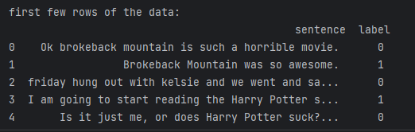

# Sentiment Classification using Transfer learning 

## Motivation 

I wanted to - 
1. Use huggingface libraries and pre-trained models 
2. Use transfer learning for Text database. 
3. Learn the word embeddings

## Objective 

We have a movie review dataset form kaggle (small dataset). It is a labelled data and we want to be able to predict the labels.

## Data Description 

This is about the films that were released at about the asame time . 

We have been provided the reviews and labels as to whether the sentiment is positive or negative. 

nearly 5500 sentences. 

## why transfer learning ? 

The dataset is so small in size that training a full ML model will lead to overfitting so early that we will never be able to generalize anything about the data. It is therefore necessary to use learned features. 

### What bert model brings ? 

1. It brings information of text embeddings. 
2. It brings a knowledge about the words and how they correlate to the other words. 

### what does huggingface brings? 

1. It brings the architecture and ease of training using predefined and documented pipelines. 

## Structure. 

1. data csv is in '/data/sentiment_csv.csv'.
2. Python notebook to do the data analysis. 

## Decisions made. 

I will write any design decisions I made here.

We have added two new layers to the model output that will help us determine the correct label. The training of the initial layers
of the bert model has been stopped though. This is done to prevent overfitting.

one layers has 512 nodes and next one has two with softmax activation. 

## Visuals to illustrate the understanding

Here are few visuals that helps me understand the bert model more clearly.




train_test split details - 20% test set, 16 % val, 64 % train set


Padding length selection - 
Shown is the histogram of lengths of a sentence


We choose 15 padding length accordingly. 

Getting the tokens using - 

and 


let's have a look at the first three reviews and their corresponding sequences - 


Observation - So, as can be seen the tokenizer just makes the sentence into dictionary indexes. It is nothing special , there is no machine learning here. However, we should remember that the dictionary indexes here are related to their corresponding embeddings in the trained bert model.

Structure of the bert model after alterations - 
```
==========================================================================================
Layer (type:depth-idx)                   Output Shape              Param #
==========================================================================================
├─BertModel: 1-1                         [-1, 15, 768]             --
|    └─BertEmbeddings: 2-1               [-1, 15, 768]             --
|    |    └─Embedding: 3-1               [-1, 15, 768]             (23,440,896)
|    |    └─Embedding: 3-2               [-1, 15, 768]             (1,536)
|    |    └─Embedding: 3-3               [-1, 15, 768]             (393,216)
|    |    └─LayerNorm: 3-4               [-1, 15, 768]             (1,536)
|    |    └─Dropout: 3-5                 [-1, 15, 768]             --
|    └─BertEncoder: 2-2                  [-1, 15, 768]             --
|    └─BertPooler: 2-3                   [-1, 768]                 --
|    |    └─Linear: 3-6                  [-1, 768]                 (590,592)
|    |    └─Tanh: 3-7                    [-1, 768]                 --
├─Linear: 1-2                            [-1, 512]                 393,728
├─ReLU: 1-3                              [-1, 512]                 --
├─Dropout: 1-4                           [-1, 512]                 --
├─Linear: 1-5                            [-1, 2]                   1,026
├─LogSoftmax: 1-6                        [-1, 2]                   --
==========================================================================================
Total params: 24,822,530
Trainable params: 394,754
Non-trainable params: 24,427,776
Total mult-adds (M): 328.53
==========================================================================================
Input size (MB): 0.00
Forward/backward pass size (MB): 0.36
Params size (MB): 94.69
Estimated Total Size (MB): 95.06
==========================================================================================
==========================================================================================
Layer (type:depth-idx)                   Output Shape              Param #
==========================================================================================
├─BertModel: 1-1                         [-1, 15, 768]             --
|    └─BertEmbeddings: 2-1               [-1, 15, 768]             --
|    |    └─Embedding: 3-1               [-1, 15, 768]             (23,440,896)
|    |    └─Embedding: 3-2               [-1, 15, 768]             (1,536)
|    |    └─Embedding: 3-3               [-1, 15, 768]             (393,216)
|    |    └─LayerNorm: 3-4               [-1, 15, 768]             (1,536)
|    |    └─Dropout: 3-5                 [-1, 15, 768]             --
|    └─BertEncoder: 2-2                  [-1, 15, 768]             --
|    └─BertPooler: 2-3                   [-1, 768]                 --
|    |    └─Linear: 3-6                  [-1, 768]                 (590,592)
|    |    └─Tanh: 3-7                    [-1, 768]                 --
├─Linear: 1-2                            [-1, 512]                 393,728
├─ReLU: 1-3                              [-1, 512]                 --
├─Dropout: 1-4                           [-1, 512]                 --
├─Linear: 1-5                            [-1, 2]                   1,026
├─LogSoftmax: 1-6                        [-1, 2]                   --
==========================================================================================
Total params: 24,822,530
Trainable params: 394,754
Non-trainable params: 24,427,776
Total mult-adds (M): 328.53
==========================================================================================
Input size (MB): 0.00
Forward/backward pass size (MB): 0.36
Params size (MB): 94.69
Estimated Total Size (MB): 95.06
==========================================================================================
```
Learning curves of training and validation set - 


And the final results on the test set - 


## Final Results. 


the final results looks pretty promising for unknown dataset. 

This work shows utility of BERT , Attention nets and transformers and transfer learning. 

